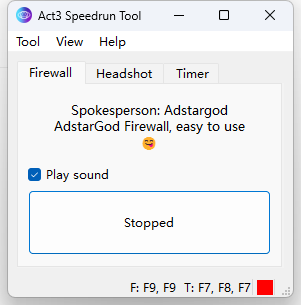
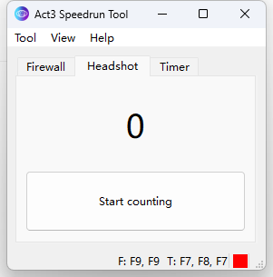
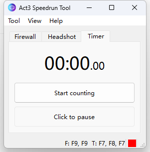
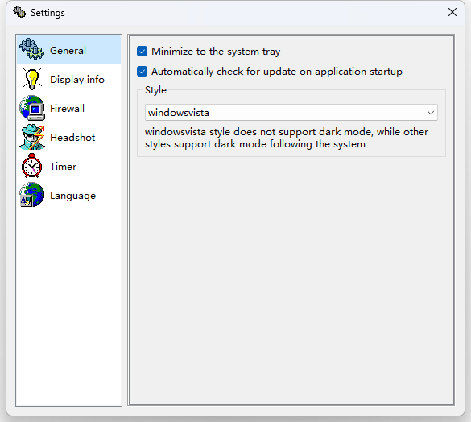
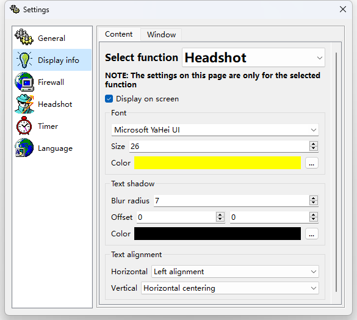
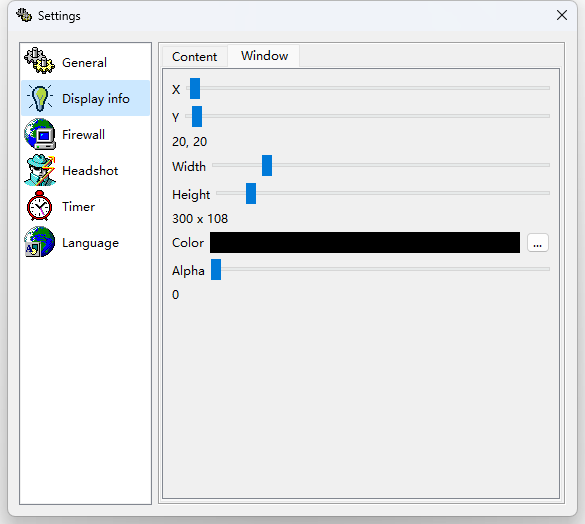
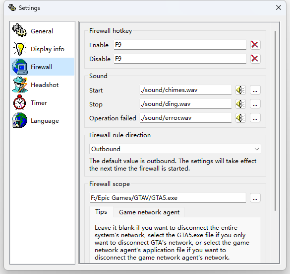
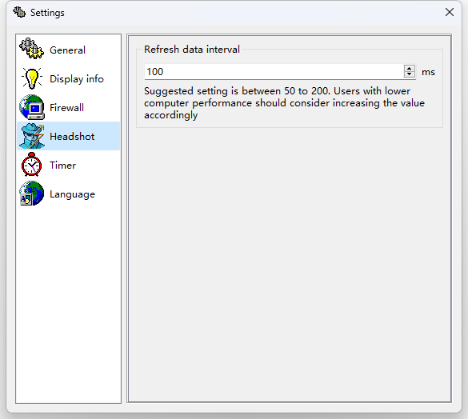
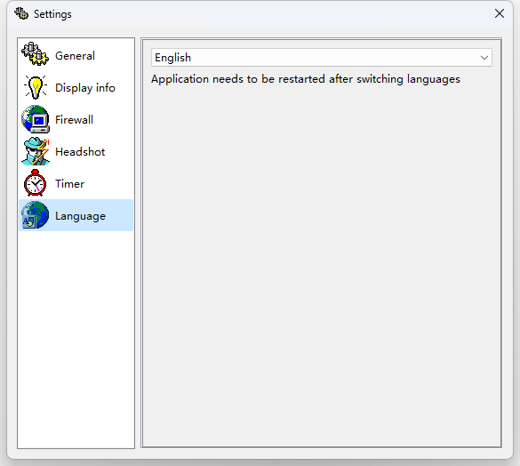

    

        
    

    <h1>🌐 Act3 Speedrun Tool</h1>
    

        
        
        
        
        
        
    

    

        A <b>GTAOL doomsday scenario speedrun tool</b> that supports quick <b>startup of the firewall</b>, <b>automatic counting of headshots</b> and <b>timing</b>. This tool only reads the memory and does not write the memory.
    

    

        <b><a href="doc/README/README-zh-rCN.md">中文</a></b>
    

## 🎉 Features

1. Support tracking the number of **headshots** in the mission (**Not counted**: Headshot **civilians**, killing **Juggernaut**, **Orbital Canon** kills, killing **Avon Hertz**).
2. Support **fast disconnection** of specific programs (hotkey).
3. Support manual **timing** (hotkey).
4. Support displaying the headshot count/timer **on the screen** (only applicable to windowed or borderless mode).
5. ......

## 🤩 Screenshots

## ✨ Other works

<table>
<thead>
  <tr>
    <th>Work</th>
    <th>Description</th>
    <th>Link</th>
  </tr>
</thead>
<tbody>
  <tr>
    <td></td>
    <td><b>Rays (Record All Your Stickers)</b>, A tool to <b>record, search and manage stickers</b> on your phone. 🥰 Are you still struggling with <b>too many stickers on your phone</b> and having trouble finding the ones you want? This tool will help you <b>manage your stickers</b>! 😋</td>
    <td><a href="https://github.com/SkyD666/Rays-Android">https://github.com/SkyD666/Rays-Android</a></td>
  </tr>
  <tr>
    <td></td>
    <td><b>Raca (Record All Classic Articles)</b>, a tool to <b>record and search abstract passages and mini-essays</b> in the comments section locally. 🤗 Are you still having trouble remembering the content of your mini-essay and facing the embarrassing situation of forgetting the front, middle and back? Using this tool will help you <b>record the mini-essays</b> you come across and never worry about forgetting them again! 😋</td>
    <td><a href="https://github.com/SkyD666/Raca-Android">https://github.com/SkyD666/Raca-Android</a></td>
  </tr>
  <tr>
    <td></td>
    <td><b>NightScreen</b>, when you <b>use your phone at night</b> 🌙, Night Screen can help you <b>reduce the brightness</b> of the screen and <b>reduce the damage to your eyes</b>.</td>
    <td><a href="https://github.com/SkyD666/NightScreen">https://github.com/SkyD666/NightScreen</a></td>
  </tr>
</tbody>
</table>

## 📃 License

This software code is available under the following **license**

[**GNU General Public License v3.0**](LICENSE)
