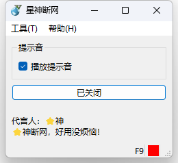
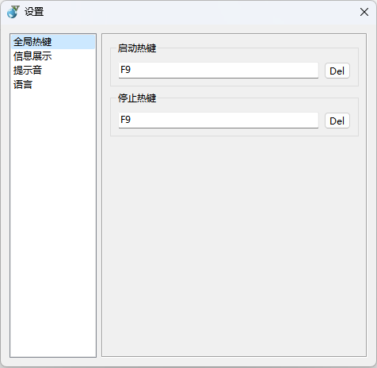
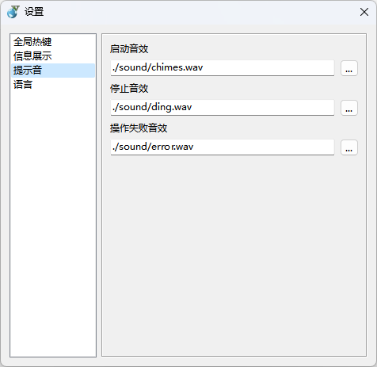
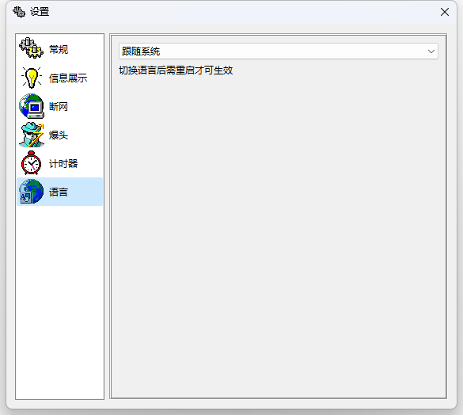

    

        
    

    <h1>🌐 AutoFirewall</h1>
    

        
        
        
        
        
    

    

        一个针对 GTA OL 的小工具，支持快速启用 / 停用防火墙规则。
    

    

        <b><a href="../../README.md">English</a></b>
    

## 🤩 应用截图

 
 

## ✨ 其他作品

<table>
<thead>
  <tr>
    <th>作品</th>
    <th>描述</th>
    <th>链接</th>
  </tr>
</thead>
<tbody>
  <tr>
    <td></td>
    <td><b>Rays (Record All Your Stickers)</b>，一个在本地<b>记录、查找、管理表情包</b>的工具。🥰 您还在为手机中的<b>表情包太多</b>，找不到想要的表情包而苦恼吗？使用这款工具将帮助您<b>管理您存储的表情包</b>，再也不因为找不到表情包而烦恼！😋</td>
    <td><a href="https://github.com/SkyD666/Rays-Android">https://github.com/SkyD666/Rays-Android</a></td>
  </tr>
  <tr>
    <td></td>
    <td><b>Raca (Record All Classic Articles)</b>，一个在本地<b>记录、查找抽象段落/评论区小作文</b>的工具。 🤗 您还在为记不住小作文内容，面临<b>前面、中间、后面都忘了</b>的尴尬处境吗？使用这款工具将<b>帮助您记录您所遇到的小作文</b>，再也不因为忘记而烦恼！😋</td>
    <td><a href="https://github.com/SkyD666/Raca-Android">https://github.com/SkyD666/Raca-Android</a></td>
  </tr>
  <tr>
    <td></td>
    <td><b>NightScreen</b>，当您在<b>夜间🌙</b>使用手机时，NightScreen 可以帮助您<b>减少屏幕亮度</b>，减少对眼睛的伤害。</td>
    <td><a href="https://github.com/SkyD666/NightScreen">https://github.com/SkyD666/NightScreen</a></td>
  </tr>
</tbody>
</table>

## 📃 许可证

使用此软件代码需**遵循以下许可证协议**

[**GNU General Public License v3.0**](../../LICENSE)
